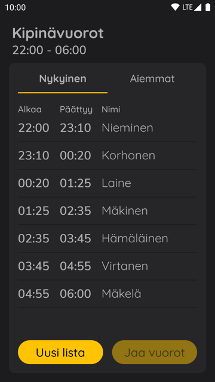
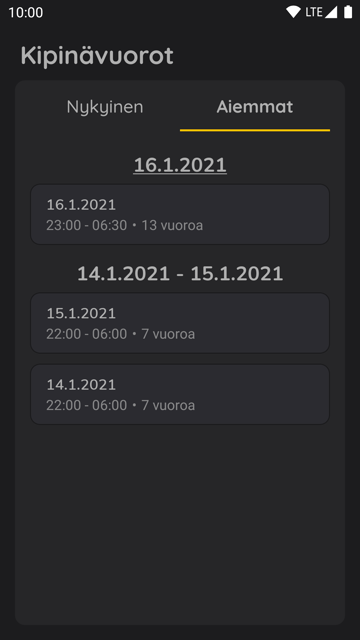

# Kipinävuorot

Kipinävuorot is a android app that can create a list of shifts (kipinälista) from given timespan and participants that you add. All lists are saved locally and are visible in the app.

If you have no idea what "kipinälista" is read the [long explanation of the problem](#long-explanation-of-the-problem).

If you are interested in knowing how the app generates the lists read [this](#generating-the-list).

> I have not released a production app yet. When or if I release one it will be mentioned here.

## Motivation

The project exists because it was difficult to manually create a list of shifts (kipinälista) where participants would get assigned to the shifts **fairly** and **conveniently**. There wasn't any app that does this so I thought it would make for a great project. I also wanted to learn [React Native](https://reactnative.dev) so this gave me a good opportunity.

The app is android only because I wanted to be able to test it on real hardware since I only have android phone.

## Technologies used

**Built with**

* [React Native](https://reactnative.dev)
* JavaScript/[TypeScript](https://www.typescriptlang.org)

**Reasoning behind why I used these technologies**

* I used **React Native** because it seemed like a useful tool and this project gave me a good opportunity to learn that. I also have previous [React](https://reactjs.org) experience so it was quite bit easier to start learning React Native. It also didn't seemed reasonable to learn a whole new programming language just for this project.

* I used **TypeScript** because it is easy to maintain and understand. It catches type errors in compile-time which has saved me some debugging time.

## Screenshots

## Long explanation of the problem

Imagine if you are staying a night in a tent with other people and that tent has a stove (kamiina) that burns wood and heats up the tent. There needs to be someone all night who puts more wood to the stove so that the tent stays warm and also watching the stove for fire safety. So the best way to handle that is to divide the whole night into a shifts and each person (participant) staying in the tent will watch the stove for one shift each night. That way everyone gets to sleep the same amount.

Previously you would need to calculate the shifts manually and decide who gets what shift. The **problem** becomes when your trying to decide who gets what shift fairly based on previous shifts. It becomes really difficult to do manually when your staying multiple nights with the same people.

One solution would be to assign each person (participant) to the shifts randomly. But that isn't fair because someone might get the same shift over and over again. Also it wouldn't be convenient because when the shift ends the person who is watching the stove needs to locate a new person within the tent every night for the next shift.

So thats why I developed a better solution explained in the [generating the list](#generating-the-list) section.

## Generating the list

The shift generator (found [here](ts/shift-generator.ts)) tries to be **fair** and **convenient** when assigning participants to the shifts.

The participants are assigned to the shifts (kipinävuoroihin) based on the previous lists. If no previous lists are found or entirely new list with different participants is created then the participants get assigned to the shifts randomly.

After the first list is generated the following lists participants get assigned to the shifts in a way that every participants subsequent participant is always the same. So it should be easier to locate the next participant in the tent after the first night because it is always the same participant (if the participants don't change their sleeping location).

Each participant gets assigned to a shift that it hasn't previously been assigned to. If a participant has been previously assigned to every shift the same number of times than the other participants have then the participant can be assigned to any shift. Shifts durations are around the same for everyone. Some shifts are 5 minutes longer than others because each shifts minutes get rounded to 5 for convenience.

The **generated list** contains all shifts and each shift contains it's start and end times (rounded to five minutes) and participants name that got assigned to that shift.

## Development environment
For development evironment setup follow the guide on [here](https://reactnative.dev/docs/environment-setup). To run the production build follow the guide on [here](https://reactnative.dev/docs/signed-apk-android).

**Dependencies**

* [Node](https://nodejs.org) version 10 or newer
* [JDK](https://openjdk.java.net/projects/jdk8) version 8 or newer
* [Android Studio](https://developer.android.com/studio)
* Android SDK
    * API Level: 29
    * Build Tools: 29.0.2
    * System Image: Intel x86 Atom_64 System Image
* [React](https://reactjs.org) version 16.13.1
* [React Native](https://reactnative.dev) version 0.63.4

**Installation**

`npm install`

**Running the development version**

`npm run android`

**Running the production version**

`npm run android-release`